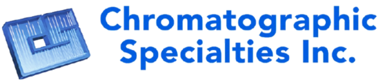
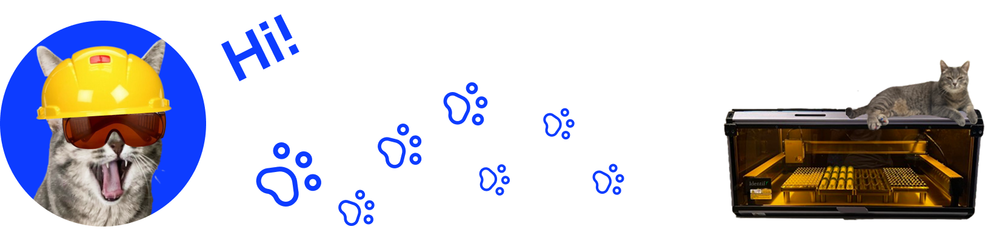

Welcome to the GitHub home of Chromatographic Specialties Inc. This organization is the central location for engineering, R&D, and software development, including our CHROMSPEC™ line of instrumentation software solutions.

## 🧪 Who are we?

Chromatographic Specialties Inc. is a family-owned and operated company based in Brockville, Ontario, Canada. Since 1963, we’ve specialized in providing high-quality Gas & Liquid Chromatography and Sample Preparation consumables and instrumentation to the Canadian scientific community.

In 1998, MJS BioLynx Inc. was founded under the same roof to support the growing needs of Life Science researchers in Canada, with a focus on cell, molecular, and microbiology. In 2023, CSI and MJS BioLynx were unified into one company, with MJS BioLynx now operating as the Life Sciences Division of Chromatographic Specialties Inc.

Our continued success is built on a foundation of technical expertise, personalized service, and top-tier products. We are proud to serve laboratories across Canada in both official languages.

## 🐾 Meet Gracie — The Engineering Cat

Gracie is the unofficial mascot of Engineering and Development at Chromatographic Specialties Inc. She's a frequent sight across our software interfaces, and proudly serves as the mascot of IDentify.

She’s a quiet observer during sprints, a vocal presence during lunch breaks, and a great companion when it’s time to debug. She's really the boss around here and su-purr-vises us frequently.

## 📫 Let's get in touch!

**Chromatographic Specialties Inc.**  
300 Laurier Blvd, P.O. Box 1150  
Brockville, ON, K6V 5W1  
T: 613-342-4678 | 1-800-267-8103  
W: [chromspec.com](https://chromspec.com)  
E: General Inquiries: [sales@chromspec.com](mailto:sales@chromspec.com)  
E: Technical Support: [tech@chromspec.com](mailto:tech@chromspec.com)  
E: Instrumentation: [instrum@chromspec.com](mailto:instrum@chromspec.com)  
E: Returns: [returns@chromspec.com](mailto:returns@chromspec.com)

### GitHub Contact:

**Cameron MacDonald**  
[cameronm@chromspec.com](mailto:cameronm@chromspec.com)  
1-800-267-8103, EXT. 534
chromspec.com / biolynx.ca

---

© 2025 Chromatographic Specialties Inc. All rights reserved.
