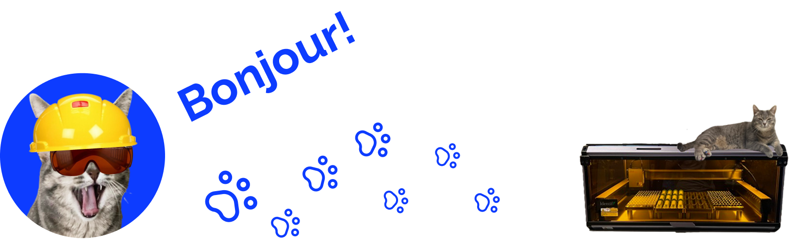

Bienvenue sur la page GitHub de **Chromatographic Specialties Inc.**  
Cette organisation est le point central de notre ingénierie, R&D, et développement logiciel, incluant notre gamme de solutions logicielles pour instruments **CHROMSPEC™**.

<a href="./README.md">To view this page in English, please click here.</a>

## 🧪 Qui sommes-nous?

**Chromatographic Specialties Inc.** est une entreprise familiale située à Brockville, en Ontario, au Canada. Depuis 1963, nous sommes spécialisés dans la fourniture de consommables et d'instruments de haute qualité pour la chromatographie en phase gazeuse et liquide, ainsi que pour la préparation d’échantillons, destinés à la communauté scientifique canadienne.

En 1998, **MJS BioLynx Inc.** a été fondée sous le même toit pour répondre aux besoins croissants des chercheurs en sciences de la vie au Canada, avec un accent particulier sur la biologie cellulaire, moléculaire et la microbiologie. En 2023, CSI et MJS BioLynx ont été réunies en une seule entité, **MJS BioLynx** devenant désormais la Division des sciences de la vie de Chromatographic Specialties Inc.

Notre succès repose sur notre expertise technique, notre service personnalisé et la qualité supérieure de nos produits. Nous sommes fiers de servir les laboratoires partout au Canada dans les deux langues officielles.

## 🐾 Voici Gracie — la chatte de l’ingénierie

**Gracie** est la mascotte non officielle de l'équipe d'ingénierie et de développement chez Chromatographic Specialties Inc.  
Vous la retrouverez souvent dans nos interfaces logicielles, et elle est également la fière mascotte de **IDentify**.

Discrète pendant les sprints, bavarde à l’heure du lunch, et précieuse compagne de débogage, Gracie est (officiellement ou non) la vraie patronne ici — elle nous **surveille** de près avec une patte experte.

## 📫 Contactez-nous

**Chromatographic Specialties Inc.**  
300, boulevard Laurier, C.P. 1150  
Brockville, ON, K6V 5W1  
Tél. : 613-342-4678 | 1-800-267-8103  
Site : [chromspec.com](https://chromspec.com)  
Courriel général : [sales@chromspec.com](mailto:sales@chromspec.com)  
Soutien technique : [tech@chromspec.com](mailto:tech@chromspec.com)  
Instrumentation : [instrum@chromspec.com](mailto:instrum@chromspec.com)  
Retours : [returns@chromspec.com](mailto:returns@chromspec.com)

### Contact GitHub :

**Cameron MacDonald**  
[cameronm@chromspec.com](mailto:cameronm@chromspec.com)  
1-800-267-8103, poste 534  
chromspec.com / biolynx.ca

---

© 2025 Chromatographic Specialties Inc. Tous droits réservés.
